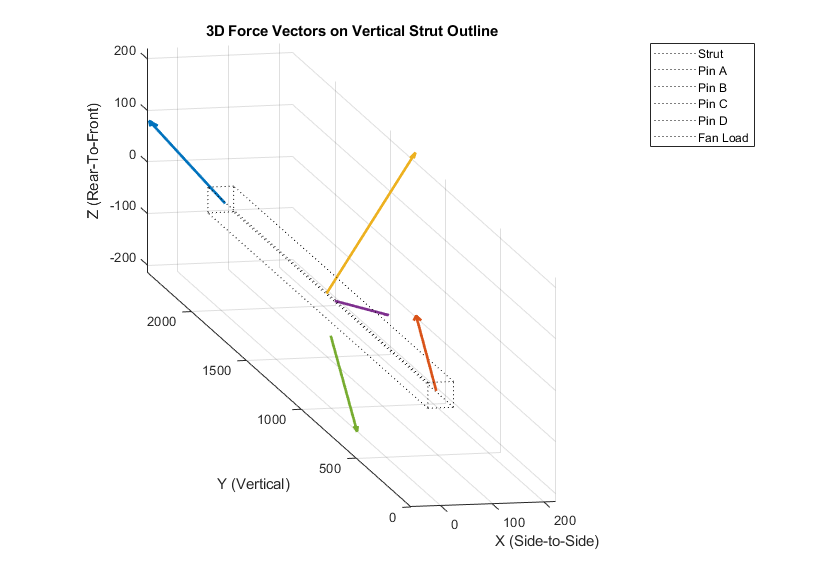
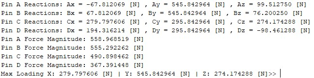

# ME-3180-Spring-2026
My Solutions for ME 3180 Design Problems
## Design Problem 1

I'll update this read me in a little bit/few days about all of my equations and explanations.

### Known Errors/Issues:
* Distance from strut edge to cg of fan is 100mm, I assumed it was 100mm from neutral axis of strut to cg of the fan. This lever arm distance is wrong.
* I did not calculate the torsion in the strut, but it should work. If it doesn't pass, just increase the thickness of the strut channel.
* The tighter belt tension calculation may be incorrect, but I used fan mechanical power and fan pulley radius. I think my calc makes intuitive sense at least.

My assumptions on global loading and localized loading are as follows:
* Upper and Lower Pins are modeled as simply supports with the strut as a beam in bending being loaded by weight and thrust forces.
* Middle Pins are modeled as localized loading with belt tension forces and weight of fan assembly loading upon them.

*Requirement 10 is the most important requirement in this problem, it will make your static analysis determinate. Without it, the strut is statically indeterminate.*

